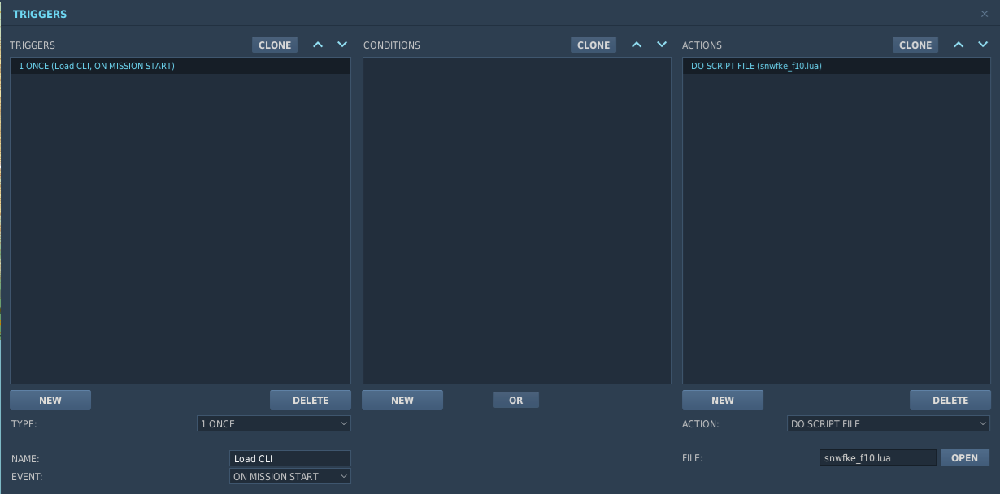

<h1>
    
    f10
    
    
</h1>

**f10** is a simple, robust & easily modifiable ME CLI[^1] for DCS — <i>using the F10 map</i>.

Inspired by other mission systems, f10 is designed to be a plug-and-play solution for developers to add map marker commands to singleplayer or multiplayer missions.

[^1]: This is the abbreviation for a [command-line interface](https://en.wikipedia.org/wiki/Command-line_interface), majorly responsible
for allowing developers to execute commands on any given system.

## Features


<ul><ul>
    <b>Simple to learn.</b><br/>
    f10 is built to cater towards the inexperienced, this tooling has been battle-tested across many multiplayer servers.<br/>
    <a href="#getting-started">Learn more →</a>
</ul></ul>


<ul><ul>
    <b>Behaviour you can expect.</b><br/>
    The CLI has been thoroughly documented for you to better understand its nature, including the parser. Basic and minimal examples can also be found for AI behaviour, e.g. movement.
</ul></ul>


<ul><ul>
    <b>Easily modifiable.</b><br/>
    f10's structure is scaled by desired behaviour and modularised through written command schema,
    making it simple to modify & layer.<br/>
</ul></ul>

## Getting Started

> [!WARNING]
> If you're updating the script, you must re-add the file and then save the mission.

When defining your mission triggers, add the following condition and action:



You may now add a separate `DO SCRIPT` action, or include another `DO SCRIPT FILE`. Here is a basic example of working with the ME environment:

```lua
local EventHandler = {}

function EventHandler:onEvent(event)
    -- in this example, the commands only apply after the map marker is deleted.
    if event.id == world.event.S_EVENT_MARK_REMOVED and event.text ~= "" then
        -- this gives us a Context class, with unit, (name) command, (name) and args (flags)
        cli = f10Cli(event.text)

        -- as long as the command name is detected, you can call methods from Context
        -- you can also define your own Context functions if you want to program behaviour
        if cli.command == "help" then
            playerGroupID = event.initiator:getGroup():getID()
            trigger.action.outTextForGroup(playerGroupID, cli:help(), 15)
        end
    end
end
```

## Advanced

To learn more how to gain the most out of f10, please read our [usage documentation](USAGE.md).
